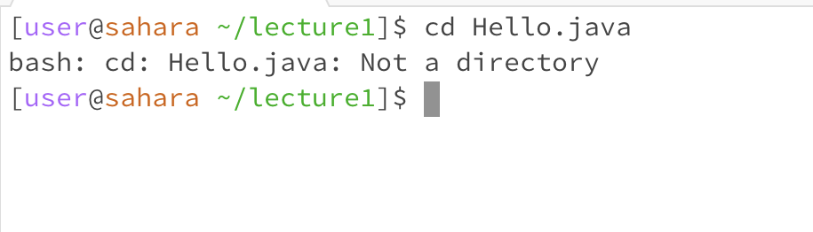
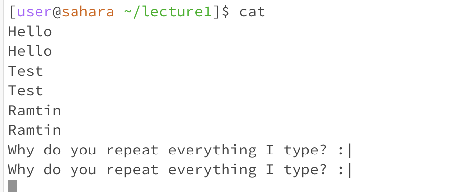
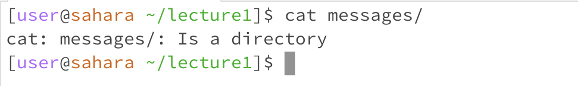
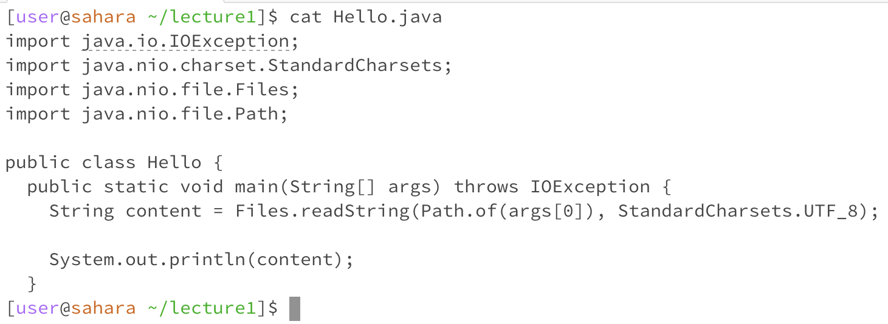

# A Summary of the commands `cd`, `ls`, and `cat` in Linux with examples

For each command, we will examine the output when the command is ran:
1. with _no arguments_
2. with a path to a _directory_ as an argument
3. with a path to a _file_ as an argument
For each of the cases, there will also be a screenshot showing the command and its output.

## `cd` command
The `cd` command is used for navigating the filesystem in Linux machines.

### No argument
When the `cd` command is ran without any arguments, it will take us to the home directory for the current user. This behavior is expected and it is not an error.

working directory: `/home/lecture1/messages`

### Directory as argument
When `cd` is ran with directory as argument, it navigates to that directory in the current terminal and after the command executes, we will be 'in' that directory. If the directory doesn't exist, we will get an error.

working directory: `/home`

### File path as argument
Since we can't be 'inside' of a file in the terminal, the `cd` command will give an error.

working directory: `/home/lecture1`

## `ls` command
The `ls` command lists the items that are in the current working directory.

### No argument
When ran with no argument, it will list the items that are in the current working directory. This behavior is expected and it is not an error.

working directory: `/home/lecture1`

### Directory as argument
If the directory exists, it will list the contents of that directory; if it doesn't exist, it will print an error.

working directory: `/home/lecture1`

### File path as argument
If the file exists, it will print its name, and if it doesn't exist, it will print an error.

working directory: `/home/lecture1`

## `cat` command
We use the `cat` command to dump the contents of a file to the standard output.

### No argument
When run with no argument, it will wait for user input in an infinite loop and every time we hit enter, it will print what we have typed in the last line.

working directory: `/home/lecture1`

### Directory as argument
Since `cat` is for viewing the contents of a file, it will give an error when run with a directory as argument.

working directory: `/home/lecture1`

### File path as argument
In this case, the `cat` command will print the contents of the provided file in the standard output. The output will be an error if the file doesn't exist.

working directory: `/home/lecture1`
