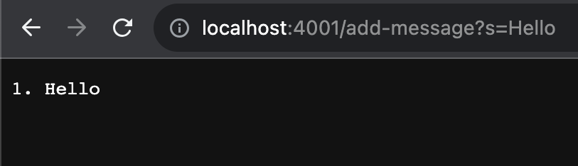
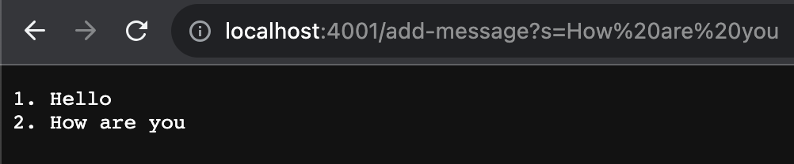
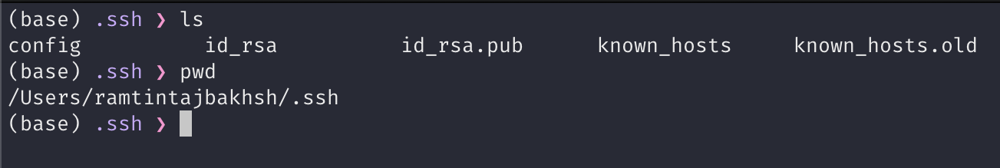
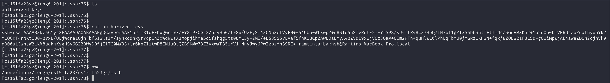
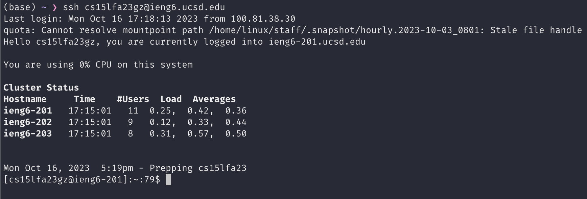

# Lab Report 2 for CSE15L

## String Server
In the first part of this report, we will write a `StringServer` which is going to be a webserver written in Java. This webserver is going to support the `add-message` path with a string as its query parameter. The request will look like this:

`/add-message?s=<string>`

After every time this request is run, the webserver will return all the messages we have added so far in the following format:

```
1. <Message 1>
2. <Message 2>
3. <Message 3>
...
```

Here is the code for the `StringServer` class:
```java
import java.io.IOException;
import java.net.URI;
import java.util.ArrayList;

class Handler implements URLHandler {
    ArrayList<String> strings = new ArrayList<>();

    private String createAllMessageResponse() {
        StringBuilder sb = new StringBuilder();
        for (int i = 0; i < strings.size(); ++i) {
            sb.append(Integer.toString(i+1) + ". " + strings.get(i) + "\n");
        }

        return sb.toString();
    }

    public String handleRequest(URI url) {
        if (url.getPath().equals("/")) {
            return "Welcome to String Server!";
        }

        if (url.getPath().equals("/add-message")) {
            String[] parameters = url.getQuery().split("=");
            if (parameters[0].equals("s")) {
                strings.add(parameters[1]);        
            }
            return createAllMessageResponse();
        }

        return "404 Not Found!";
    }
}

class StringServer {
    public static void main(String[] args) throws IOException {
        int port = Integer.parseInt(args[0]);
        Server.start(port, new Handler());
    }
}
```

Let's go through what happens in the program when we run it twice with the `/add-message` path:



When the request is sent to the server, the `handleRequest` method will be called. The `url` parameter passed to this method will have the value "add-message" in its path field and the value "s=Hello" in its query field. Also, since this is the first time we are adding a message after running the server, the `strings` ArrayList will start out empty and will be `["Hello"]` after the method is fully executed.



When this request is sent to the server, again, the `handleRequest` method will be called. This time, `url` will have the value "s=How are you" in its query field while having the same path as last time. In this method, the string "How are you" will be appended to the `strings` ArrayList and so the `strings` field in our class will be `["Hello", "How are you"]` when all is said and done.

## SSH Authentication using public/private keys

Here is where my ssh private key is located on my local machine. it is stored in the file called `id_rsa`:



Here is where my ssh public key is stored on `ieng6`:



And here is me logging in the `ieng6` machine without being asked to type my password :D



## Something I learned in weeks 2 and 3

I never knew about the fact that I could ssh into a remote machine without inputting my password if I copy my public key over to the server. This makes logging into these servers much more convenient.
