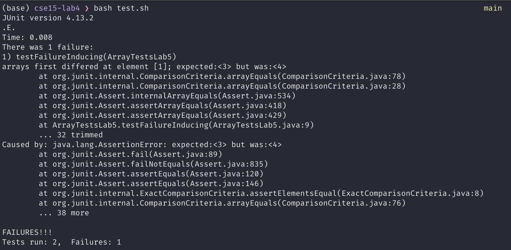

# Lab Report 3 - Bugs and Commands

## Part 1 - Bugs

For this part, we are going to examine the bug in the reverseInPlace method in `ArrayExamples.java`. For reference, here is the code for this method:

```java
public class ArrayExamples {
    static void reverseInPlace(int[] arr) {
        for (int i = 0; i < arr.length; i += 1) {
            arr[i] = arr[arr.length - i - 1];
        }
    }
}
```

- Here is a failure-inducing JUnit test for this code:
```java
@Test
public void testFailureInducing() {
    int[] input1 = { 3, 4 };
    ArrayExamples.reverseInPlace(input1);
    assertArrayEquals(new int[] { 4, 3 }, input1);
}
```

- Here is a JUnit test that won't induce a failure
```java
@Test
public void testSucceeding() {
    int[] input2 = {3};
    ArrayExamples.reverseInPlace(input2);
    assertArrayEquals(new int[] {3}, input2);
}
```

- We can see the symptom of this bug by running these two JUnit tests:



- Here is the code before and after fixing this bug:
    - Before:

    ```java
    public class ArrayExamples {
        static void reverseInPlace(int[] arr) {
            for (int i = 0; i < arr.length; i += 1) {
                arr[i] = arr[arr.length - i - 1];
            }
        }
    }
    ```

    - After:
    ```java
    public class ArrayExamples {
        static void reverseInPlace(int[] arr) {
            for (int i = 0; i < arr.length/2; i += 1) {
                int temp = arr[i];
                arr[i] = arr[arr.length - i - 1];
                arr[arr.length - i - 1] = temp;
            }
        }
    }
    ```

This method goes through the array and swaps the Ith element with the n-Ith elements (where n is the length of the input array). The bug was that instead of swapping the elements, the method was just overwriting the values. Also the other issue was that the first version was iterating through the entire array but we should only iterate through the first half and perform the swap.

## Part 2 - Researching Commands

For this, I will research 4 more advanced concepts for the `grep` command.

### Recursive Search

We can use `-r` option to recursively search the contents of files within a directory for a pattern.

- Example 1:

```console
> grep -r "unexpected groupings" technical/

technical//biomed/1471-2148-1-8.txt:        . Notably, some of the unexpected groupings within the
technical//biomed/1471-2164-3-4.txt:          unexpected groupings can be recovered and support for
```

- Example 2:

```console
> grep -r "archaeologist" technical/

technical/plos/pmed.0020060.txt:        examiners, lawyers, archaeologists, descendants of the deceased? Where does simple respect
```

In these examples, grep searched through all the files in all the subdirectories of `technical` and listed the files and the lines that contained the pattern.

Source: `man grep`

### Desplaying Lines Around the Match

According to `man grep`, the `-A` option prints _num_ lines of trailing context after each match and `-B` prints _num_ lines of leading context before each match. Let's see a couple of examples.

- Example 1:

```console
> grep -A 3 "archaeologist" technical/plos/pmed.0020060.txt

        examiners, lawyers, archaeologists, descendants of the deceased? Where does simple respect
        for the dead play into this issue?
        The answers change over time and from place to place. The quagmire of ethical, legal,
        moral, and even aesthetic questions that surround the use (and misuse) of leftover body
```

This command printed 3 lines after the line that contained the word "archaeologist"

- Example 2:

```console
> grep -B 3 "archaeologist" technical/plos/pmed.0020060.txt

        photographed, and subjected to the esoteric tests developed for forensic laboratories to
        reveal secrets they carefully took to their graves or urns? An interdisciplinary committee?
        The law? The government? Should such decisions be made by bioethicists, scientists, medical
        examiners, lawyers, archaeologists, descendants of the deceased? Where does simple respect
```

This command printed 3 lines before the line that contained the word "archaeologist"

We can also use `-C` option to display _num_ lines of trailing and leading context for each match.

Source: `man grep`

### Finding Filenames Containing a Certain Pattern

The `-l` option only lists the files that contain the pattern and won't print the lines with the match. Here are two examples:


- Example 1:

```console
> grep -r -l "archaeologist" technical

technical/plos/pmed.0020060.txt
```

- Example 2:

```console
> grep -r -l "unexpected groupings" technical

technical/biomed/1471-2148-1-8.txt
technical/biomed/1471-2164-3-4.txt
```

As we can see in these two examples, only the file names are listed

Source: `man grep`

### Only Printing the Matching Part
`-o` option only prints the matching part of the line

- Example 1:

```console
> grep -r -o "unexpected groupings" technical

technical/biomed/1471-2148-1-8.txt:unexpected groupings
technical/biomed/1471-2164-3-4.txt:unexpected groupings
```

- Example 2:

```console
> grep -r -o "archaeologist" technical

technical/plos/pmed.0020060.txt:archaeologist
```

As we can see in the two examples above, `grep` only listed the matched pattern and not the entire line. This might seem like a boring option but it would be useful if we were looking for regular expression patterns rather than just words. For instance, this option would be useful to extract all the email addresses from a bunch of files.

Source: `man grep`
