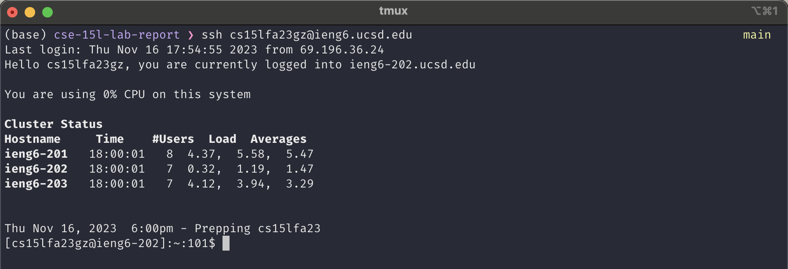
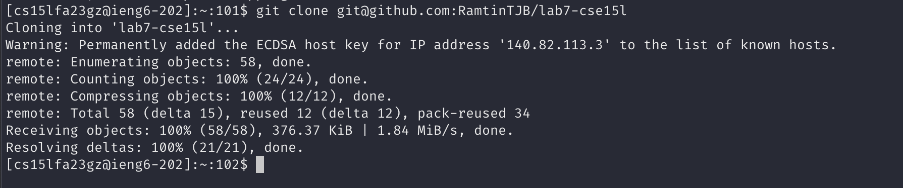
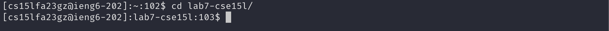
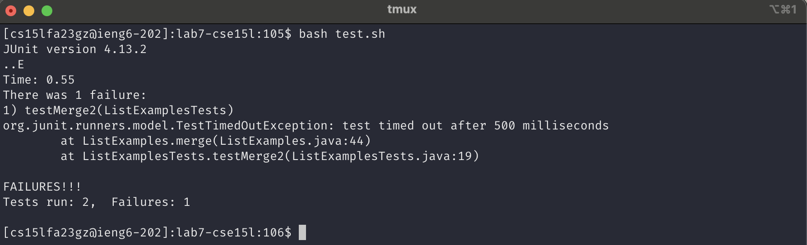
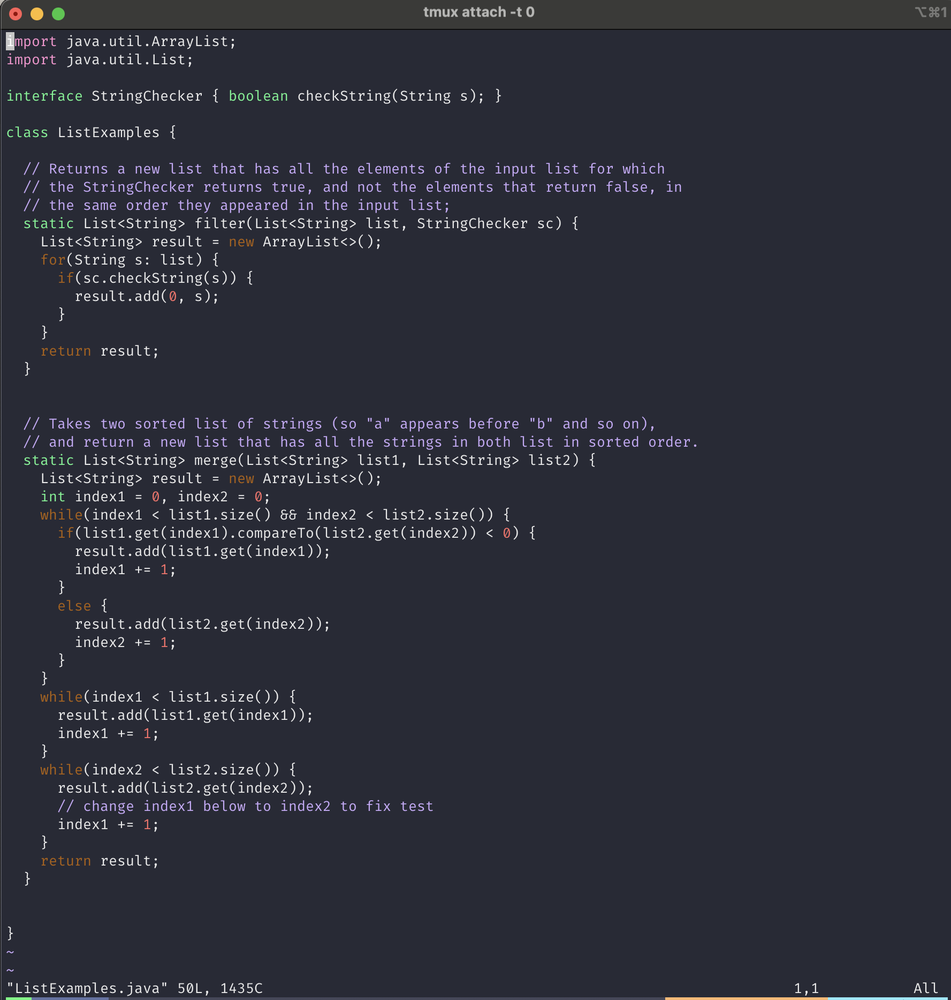
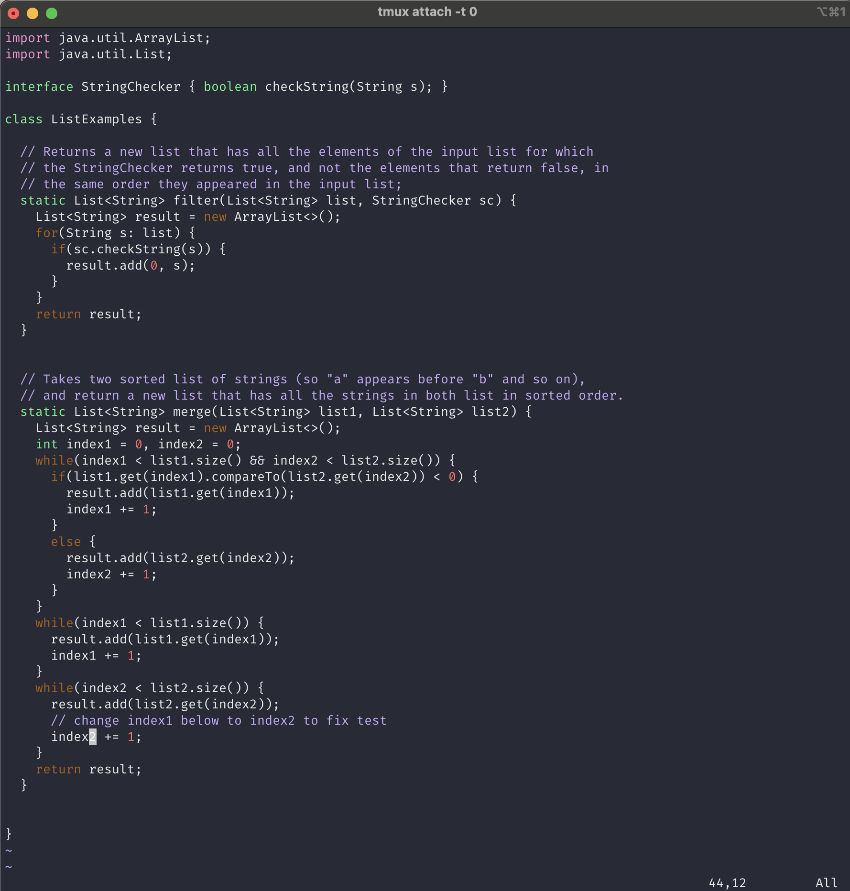
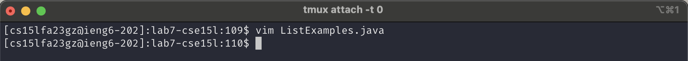
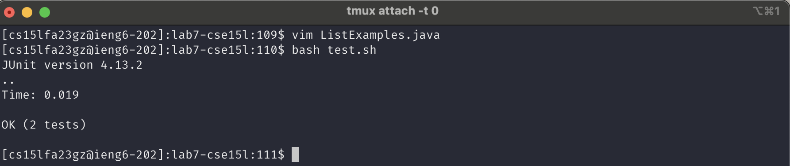
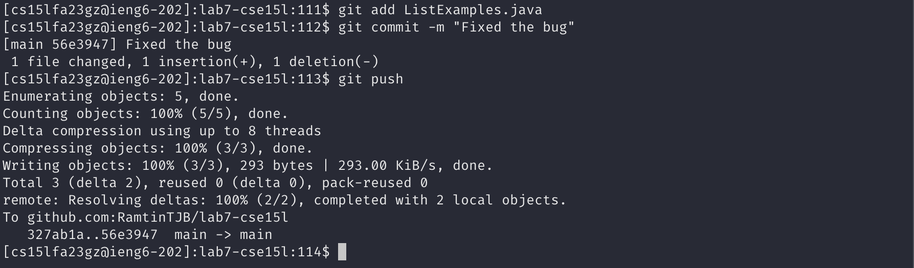

# Lab Report 4 - Vim

##### Log into ieng6
I typed `ssh cs15lfa23gz@ieng6.ucsd.edu<enter>`. Since I had previously stored my public ssh key on the ieng6 server, it didn't ask me for password and logged in automatically.

##### Clone repo
I typed `git clone git@github.com:RamtinTJB/lab7-cse15l<enter>`. The reason this works is that I generated ssh keys on the ieng6 server and added my public key to my github account.

Then I typed `cd lab<tab><enter>` to enter the directory I just cloned. The tab autocompleted the directory name to `lab7-cse15l`

##### Run the tests (fail)

`bash te<tab><enter>` the tab autocompletes the filename to test.sh which is the script that runs the junit tests.

As we can see, 1 test failed.

##### Fix the code
`vim List<tab>.j<tab><enter>` to open the file in vim. The first tab autocompletes to ListExamples and the second tab autocompletes to ListExamples.java

`G` to go to end of the file `kkkkkk` to go 6 lines up `e` to go to the end of the first word (index1) `s2` to replace the last letter from 1 to 2 `<esc>` to exit insert mode.

`:wq<enter>` to save the changes and exit vim

##### Run the tests (succeed)

`bash te<tab><enter>` the tab autocompletes the filename to test.sh which is the script that runs the junit tests.

As we can see, all tests passed this time.

##### Commit and Push

`git add Li<tab><enter>` to stage the file. The autocomplete works because that's the only file we changed `git commit -m "Fixed the bug"<enter>` to commit the staged change locally with the message "Fixed the bug" `git push<enter>` to push the changes to the remote.

