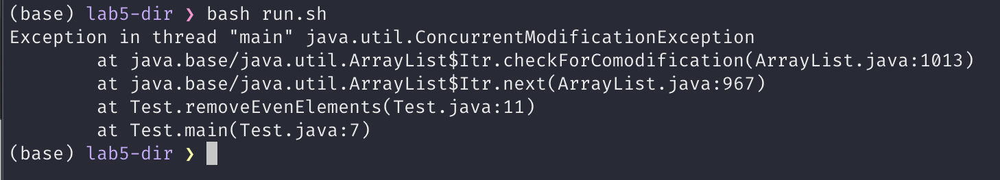
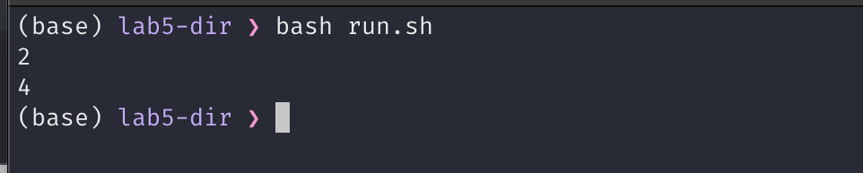
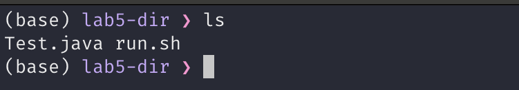
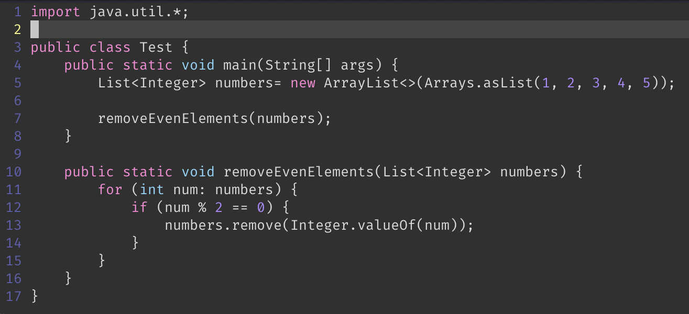
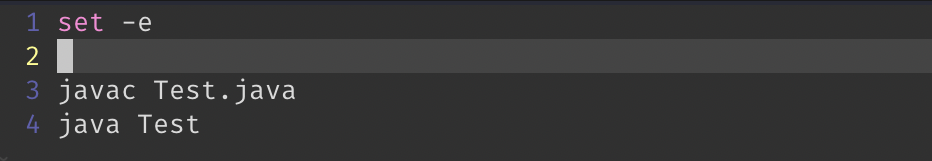

# Lab Report 5 - Putting it All Together

## Part 1 - Debugging Scenario

#### Student

I'm trying to write a function that removes all the even numbers from a list but I keep getting this strage error:



I don't really know what a `ConcurrentModificationException` is. I'm just checking if every element is even in a for loop, and remove it if it is. 

So far any input that has at least 1 even number in it induces this error. The exact input for the screenshot above is [1, 2, 3, 4, 5]

Please help!

#### TA

Have you tried printing the even numbers first just to make sure that you are detecting them correctly? If you print them and the output is 2 4 for the input above, then that means the way you are removing them from the list is incorrect. Let me know how it goes.

#### Student

I replaced `remove` with a print statement and the program did print all the even numbers correctly. Here is the output I got for the same input:



After a little bit of research, I realized that my mistake was to modify the List as I was iterating through it. This is not right and it leads to errors like this in Java. So instead of iterating through the List and removing the elements using the `remove` method, I used the removeIf method on the list itself to remove all the even numbers.

Thanks for your help!

#### File and Directory Structure

Only 2 files are needed. `Test.java` which is the program itself and `run.sh` which compiles and runs the java file.



#### Contents of the files

* Test.java



* run.sh



#### Commands to Trigger the Bug

`bash run.sh`

#### How to Fix the Bug

To fix the bug, we can replace the entire for loop in `removeEvenElements` with the following line:

```java
numbers.removeIf(num -> num % 2 == 0);
```

## Part 2 - Reflection

In the second half of the course I learned that using bash scripting or scripting in general is extremely useful in streamlining repetitive tasks. It is also very useful in reducing human errors and typos. After learning about them in class, I used them a lot for my personal projects as well.
